# BUS TICKET

* **Track:** _UX Specialization_
* **Sprint 04:** _UX PROCESS_

## Tu viaje en un ticket

   BusTicket es una web-app en la que el usuario pued encontrar todos los horarios disponibles para Cuernavaca.
   A través de la cuál el usuario obtiene un código QR con toda la información de su viaje.

   # Reto

   Mejorar la experiencia de usuarion en un viaje en autobus de la Ciudad de México a Cuernavaca.

   # Enunciado del problema

   El usuario no encuentra en un sólo lugar todos los horarios de salidas de autobús, necesita reservar su viaje, prefiere tener diferentes opciones de pago y le dan muchos documentos para realizar su viaje.

   # Nuestro proceso

   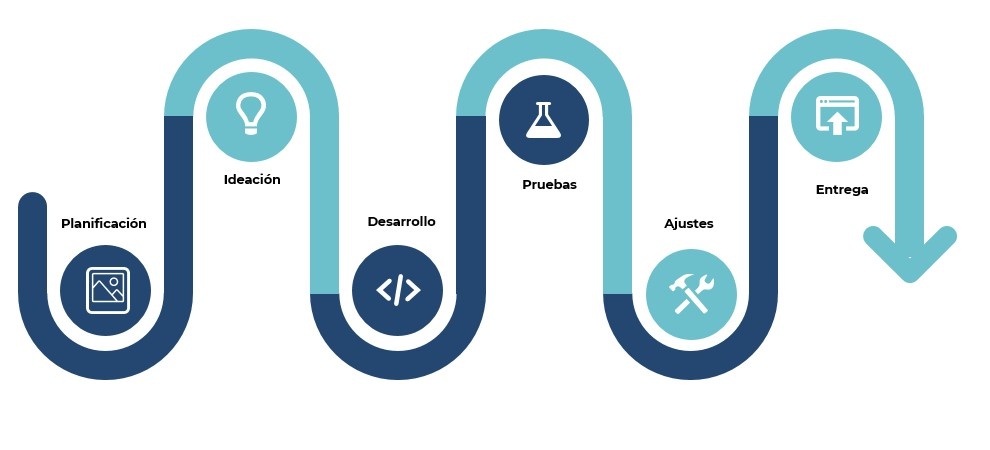

## P L A N I F I C A C I Ó N   

   # Empathy map

   El proceso de planificación, después de detectar el problema fue elaborar un map de empatía que nos permitiera conocer al usuario.

   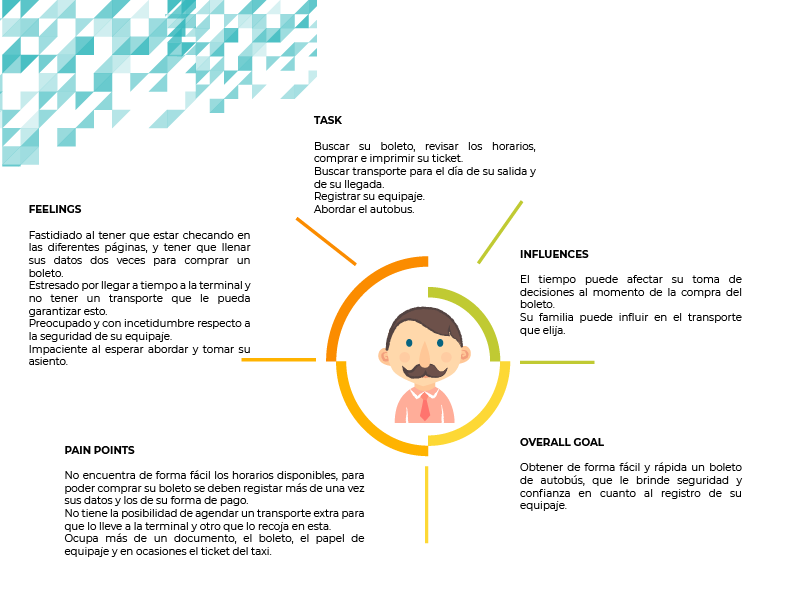

   # Research

   Se diseñó un cuestinario para saber los insights  poder diseñar una Landing page.

   https://goo.gl/forms/xtcZjqVS4CAkBdFp1

   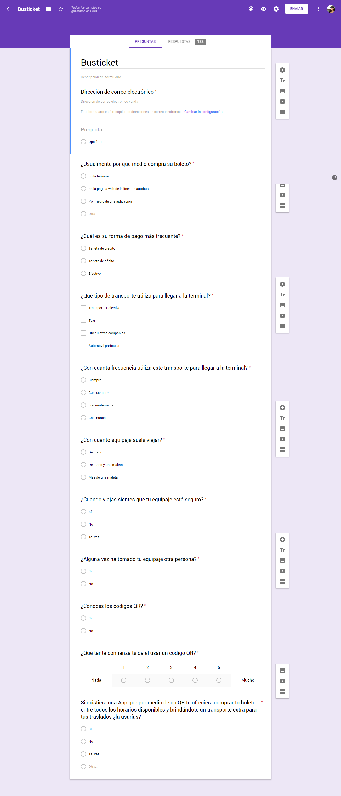

   # Estrategia

   Usamos Facebook como medio para el envio de la encuesta, y Google Forms fue nuestra herramienta.

   Creamos preguntas cerradas y nuestra muestra fue de 124 personas.

   Detectamos que hay una gran incidencia de usuarios que desea poder pagar con efectivo y directamente en la terminal.

   # Insights

   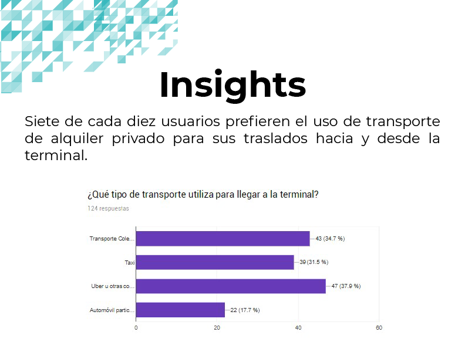

   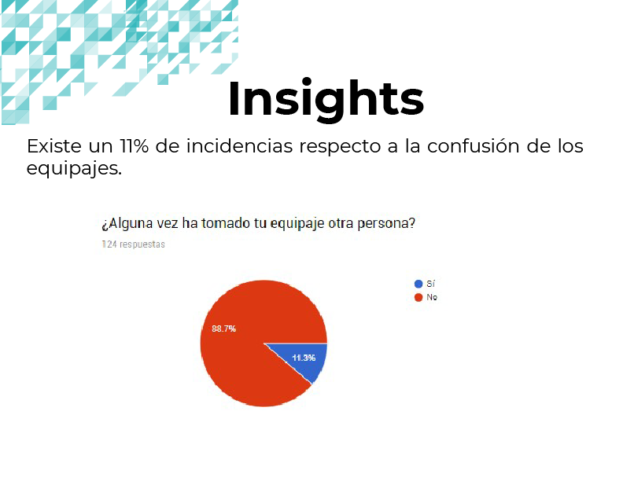

   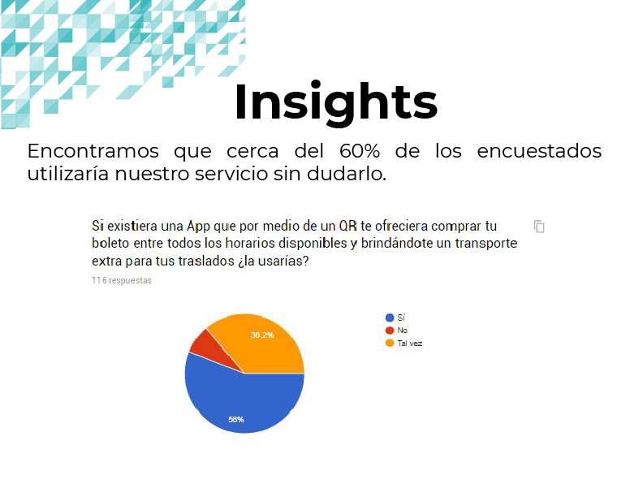

## I D E A C I Ó N

   # Perfil de usuario

   Creación del lienzo de perfil de usuario

   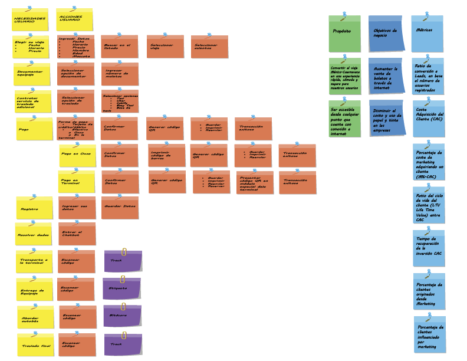

   # Sketch

   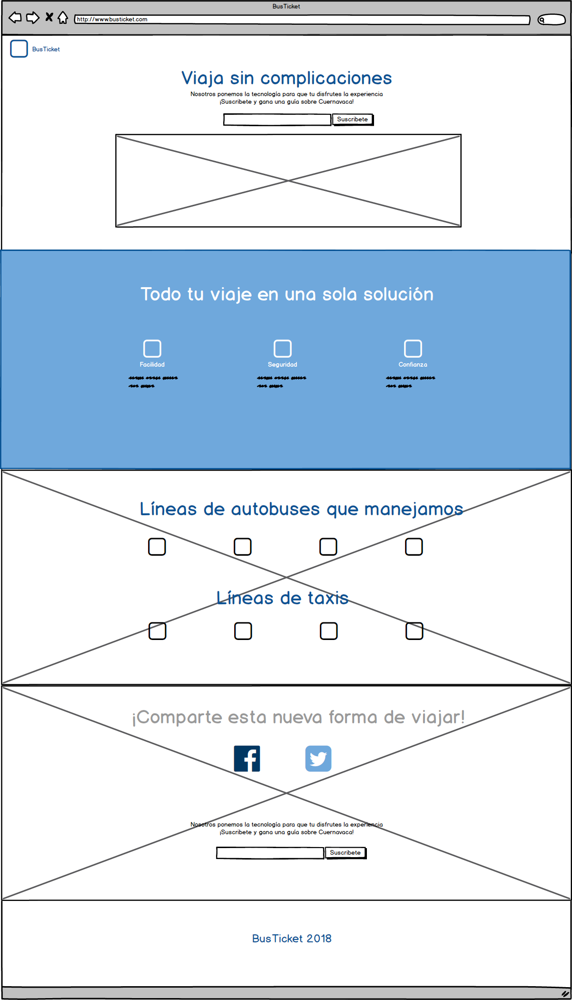

## D E S A R R O L L O

   # Diseño

   Definición de colores:

   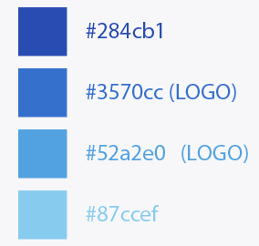

   Logo:

   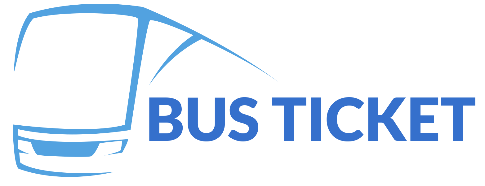

   Se utilizó Wordpress para la realización de la landing page http://busticket.techroom.mx/

## P R U E B A S   

   La probamos con algunos usuarios y utilizamos herramientas como Google analytics y HotJar para identificar el funcionamiento y ratio de conversión y se modificó el diseño en base a los insights obtenidos.

## A J U S T E S   

   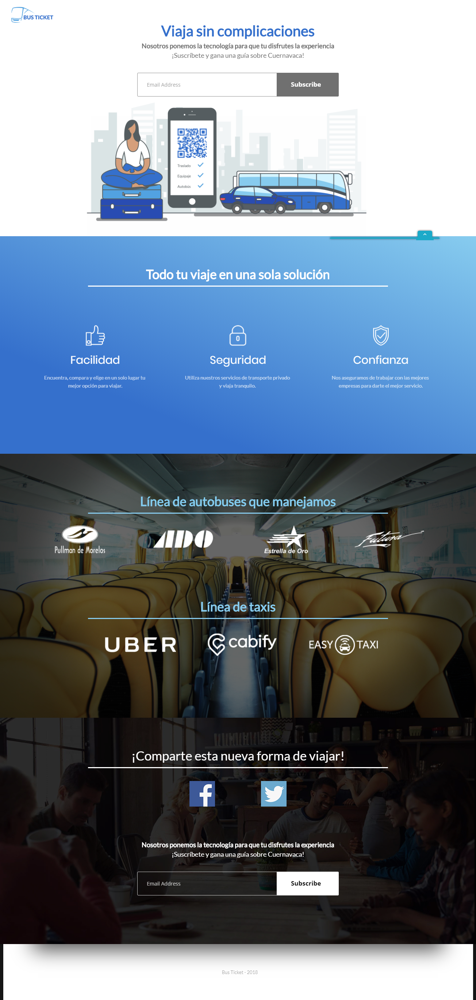

## E N T R E G A

   Creamos una campaña de e-mailing en Mail Chimp para que al suscribirse el usuario recibiera más información de la aplicación y una guía de lugares que puede visitar en Cuernavaca.

   Con los resultados de la campaña, Google analytics y HotJar obtuvimos Insights de nuestra conversión a leads.

   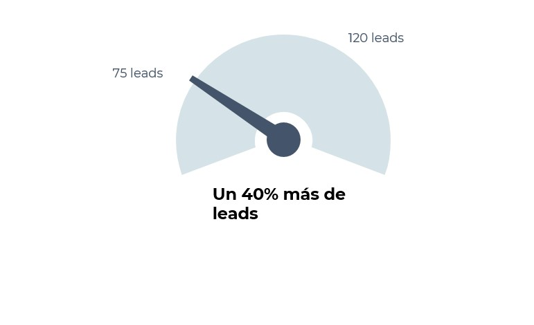

   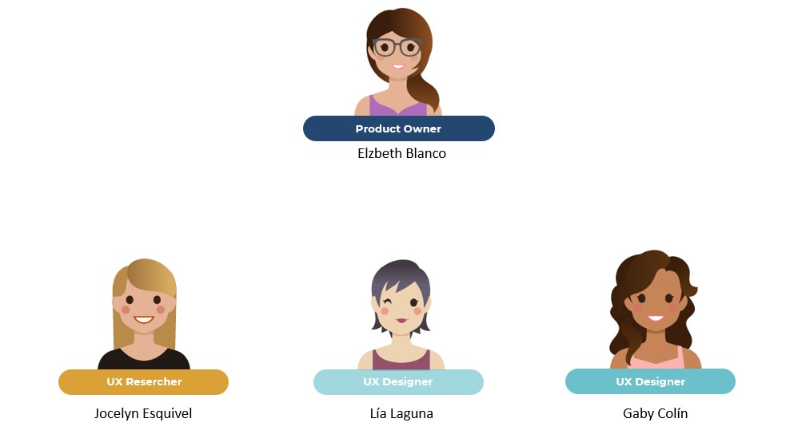

   # Nosotros ponemos la tecnología para que tu disfrutes la experiencia

## C O N C L U S I O N E S

  Gracias al proceso de diseño fue posible identificar las necesidades de los usuarios, plantear una hipotesis de solución y validarla a tráves de la investigación.

  Despues de diversas sesiones de feedback e iteraciones estamos convencidas de que nuestra solución de BusTicket es capaz de mejorar la experiencia de usuario en el trayecto Ciudad de México a Cuernavaca por autobus al facilitar los procesos, implementar medidas de seguridad y acortar los tiempos de espera.

   # BusTicket 2018
